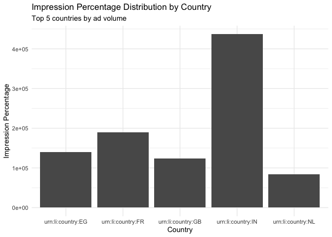

<!-- README.md is generated from README.Rmd. Please edit that file -->

# liads

<!-- badges: start -->

[](https://CRAN.R-project.org/package=liads)
[](https://lifecycle.r-lib.org/articles/stages.html#stable)
<!-- badges: end -->

**liads** is a comprehensive R client for the [LinkedIn Ad Library
API](https://www.linkedin.com/ad-library/api/ads). It provides tools for
OAuth 2.0 authentication, querying ads by various criteria, automatic
pagination, and robust data processing.

## Installation

You can install the development version of liads from
[GitHub](https://github.com/favstats/liads) with:

``` r
# install.packages("devtools")
devtools::install_github("favstats/liads")
```

## Quick Start

### 1. Authentication Setup

First, set up your LinkedIn Developer App credentials (one-time setup):

``` r
library(liads)

# Configure your LinkedIn app credentials
li_auth_configure()  # You'll be prompted to enter Client ID and Secret

# Authenticate (opens browser for OAuth)
li_auth()
```

### 2. Basic Usage

``` r
# Simple keyword search
marketing_ads <- li_query(
  keyword = "marketing",
  max_pages = 1
)
#> ℹ Retrieving page 1 (starting at index 0)...
#> ✔ Retrieved 25 ads.
#> ✔ Reached `max_pages` limit.
#> ✔ Total ads retrieved: 25
```

The most basic search uses just a keyword. This returns raw data with
list-columns for detailed analysis:

``` r
marketing_ads
#> # A tibble: 25 × 13
#>    ad_url       is_restricted restriction_details advertiser_name advertiser_url
#>    <chr>        <lgl>         <chr>               <chr>           <chr>         
#>  1 https://www… FALSE         <NA>                LinearB         https://www.l…
#>  2 https://www… FALSE         <NA>                Julie Yingst    https://www.l…
#>  3 https://www… FALSE         <NA>                LinearB         https://www.l…
#>  4 https://www… FALSE         <NA>                FORM Digital    https://www.l…
#>  5 https://www… FALSE         <NA>                FinListics Sol… https://www.l…
#>  6 https://www… FALSE         <NA>                Salesforce      https://www.l…
#>  7 https://www… FALSE         <NA>                HENNGE (North … https://www.l…
#>  8 https://www… FALSE         <NA>                LinearB         https://www.l…
#>  9 https://www… FALSE         <NA>                Splash (Splash… https://www.l…
#> 10 https://www… FALSE         <NA>                Aeqium          https://www.l…
#> # ℹ 15 more rows
#> # ℹ 8 more variables: ad_payer <chr>, ad_type <chr>,
#> #   first_impression_at <dttm>, latest_impression_at <dttm>,
#> #   total_impressions_from <int>, total_impressions_to <int>,
#> #   impressions_by_country <list>, ad_targeting <list>
```

### Searching by Country

For more targeted results, search within specific countries:

``` r
us_ads <- li_query(
  countries = c("us"),
  max_pages = 2,
  count = 10
)
#> ℹ Retrieving page 1 (starting at index 0)...
#> ✔ Retrieved 10 ads.
#> ℹ Retrieving page 2 (starting at index 10)...
#> ✔ Retrieved 10 ads.
#> ✔ Reached `max_pages` limit.
#> ✔ Total ads retrieved: 20

us_ads
#> # A tibble: 20 × 13
#>    ad_url       is_restricted restriction_details advertiser_name advertiser_url
#>    <chr>        <lgl>         <chr>               <chr>           <chr>         
#>  1 https://www… FALSE         <NA>                Every           https://www.l…
#>  2 https://www… FALSE         <NA>                Salesforce      https://www.l…
#>  3 https://www… FALSE         <NA>                Box             https://www.l…
#>  4 https://www… FALSE         <NA>                Michael Starkey https://www.l…
#>  5 https://www… FALSE         <NA>                Commvault       https://www.l…
#>  6 https://www… FALSE         <NA>                Sunbuds         https://www.l…
#>  7 https://www… FALSE         <NA>                American Indus… https://www.l…
#>  8 https://www… FALSE         <NA>                Zip             https://www.l…
#>  9 https://www… FALSE         <NA>                American Indus… https://www.l…
#> 10 https://www… FALSE         <NA>                American Indus… https://www.l…
#> 11 https://www… FALSE         <NA>                Pharmefex Cons… https://www.l…
#> 12 https://www… FALSE         <NA>                Splash (Splash… https://www.l…
#> 13 https://www… FALSE         <NA>                Seeds           https://www.l…
#> 14 https://www… FALSE         <NA>                Splash (Splash… https://www.l…
#> 15 https://www… FALSE         <NA>                Splash (Splash… https://www.l…
#> 16 https://www… FALSE         <NA>                Splash (Splash… https://www.l…
#> 17 https://www… FALSE         <NA>                La Donna Claude https://www.l…
#> 18 https://www… FALSE         <NA>                Delve - AI for… https://www.l…
#> 19 https://www… FALSE         <NA>                Precision Risk… https://www.l…
#> 20 https://www… FALSE         <NA>                ISU Steadfast … https://www.l…
#> # ℹ 8 more variables: ad_payer <chr>, ad_type <chr>,
#> #   first_impression_at <dttm>, latest_impression_at <dttm>,
#> #   total_impressions_from <int>, total_impressions_to <int>,
#> #   impressions_by_country <list>, ad_targeting <list>
```

## How Search Works

**Important**: LinkedIn’s Ad Library searches are based on the [official
API documentation](https://www.linkedin.com/ad-library/api/ads):

- **Keywords**: Multiple keywords use **AND logic** - ALL keywords must
  appear in the ad content
- **Countries**: Only shows ads that were actually served in those
  countries  
- **Dates**: Filters by when ads were served (not when they were
  created)
- **Advertiser**: Searches company names that paid for the ads

## API Parameters

The `li_query()` function supports all parameters from the LinkedIn Ad
Library API:

| Parameter | Type | Description | Example |
|----|----|----|----|
| `keyword` | String | Keywords to search in ad content (AND logic) | `"data science"` |
| `advertiser` | String | Advertiser name to search | `"Microsoft"` |
| `countries` | Character vector | 2-letter ISO country codes | `c("us", "gb", "de")` |
| `start_date` | Date/String | Start date (inclusive) | `"2024-01-01"` |
| `end_date` | Date/String | End date (exclusive) | `"2024-12-31"` |
| `count` | Integer | Results per page (max 25) | `25` |
| `max_pages` | Integer | Maximum pages to retrieve | `10` |
| `clean` | Logical | Return simplified data without list-columns | `TRUE` |
| `direction` | String | When clean=TRUE: “wide” or “long” format | `"wide"` |

## Data Structure

The function returns a tibble with the following columns:

``` r
# Key columns include:
# - ad_url: Direct link to ad preview
# - advertiser_name: Name of the advertiser
# - ad_type: Type of advertisement
# - first_impression_at, latest_impression_at: Date ranges
# - total_impressions_from, total_impressions_to: Impression ranges
# - impressions_by_country: List-column with country breakdown
# - ad_targeting: List-column with targeting criteria
```

## Advanced Examples

### How LinkedIn Ad Search Works

LinkedIn’s Ad Library API searches through ad content using specific
rules:

**Keyword Search**: When you provide multiple keywords, they are treated
with **logical AND operation**. This means ALL keywords must appear in
the ad content.

``` r
# This searches for ads containing BOTH "artificial" AND "intelligence" AND "machine" AND "learning"
tech_ads <- li_query(
  keyword = "artificial intelligence machine learning",
  countries = c("us", "gb"),
  start_date = "2025-01-01", 
  end_date = "2025-01-31",
  max_pages = 2
)
#> ℹ Retrieving page 1 (starting at index 0)...
#> ✔ Retrieved 25 ads.
#> ℹ Retrieving page 2 (starting at index 25)...
#> ✔ Retrieved 25 ads.
#> ✔ Reached `max_pages` limit.
#> ✔ Total ads retrieved: 50

tech_ads
#> # A tibble: 50 × 13
#>    ad_url       is_restricted restriction_details advertiser_name advertiser_url
#>    <chr>        <lgl>         <chr>               <chr>           <chr>         
#>  1 https://www… FALSE         <NA>                OpenText        https://www.l…
#>  2 https://www… FALSE         <NA>                Upwork          https://www.l…
#>  3 https://www… FALSE         <NA>                Detekt Biomedi… https://www.l…
#>  4 https://www… FALSE         <NA>                Web Summit      https://www.l…
#>  5 https://www… FALSE         <NA>                OpenText        https://www.l…
#>  6 https://www… FALSE         <NA>                Web Summit      https://www.l…
#>  7 https://www… FALSE         <NA>                ServiceNow      https://www.l…
#>  8 https://www… FALSE         <NA>                Web Summit      https://www.l…
#>  9 https://www… FALSE         <NA>                Web Summit      https://www.l…
#> 10 https://www… FALSE         <NA>                University of … https://www.l…
#> # ℹ 40 more rows
#> # ℹ 8 more variables: ad_payer <chr>, ad_type <chr>,
#> #   first_impression_at <dttm>, latest_impression_at <dttm>,
#> #   total_impressions_from <int>, total_impressions_to <int>,
#> #   impressions_by_country <list>, ad_targeting <list>
```

**Advertiser Search**: You can also search by the company/organization
that paid for the ads:

``` r
# Find all ads paid for by companies with "Microsoft" in their name
microsoft_ads <- li_query(
  advertiser = "Microsoft",
  countries = c("us"),
  max_pages = 1,
  count = 10
)
#> ℹ Retrieving page 1 (starting at index 0)...
#> ✔ Retrieved 10 ads.
#> ✔ Reached `max_pages` limit.
#> ✔ Total ads retrieved: 10

microsoft_ads
#> # A tibble: 10 × 13
#>    ad_url       is_restricted restriction_details advertiser_name advertiser_url
#>    <chr>        <lgl>         <chr>               <chr>           <chr>         
#>  1 https://www… FALSE         <NA>                Microsoft Azure https://www.l…
#>  2 https://www… FALSE         <NA>                Microsoft 365   https://www.l…
#>  3 https://www… FALSE         <NA>                Microsoft 365   https://www.l…
#>  4 https://www… FALSE         <NA>                Microsoft 365   https://www.l…
#>  5 https://www… FALSE         <NA>                Microsoft 365   https://www.l…
#>  6 https://www… FALSE         <NA>                Microsoft 365   https://www.l…
#>  7 https://www… FALSE         <NA>                Microsoft 365   https://www.l…
#>  8 https://www… FALSE         <NA>                Microsoft 365   https://www.l…
#>  9 https://www… FALSE         <NA>                Microsoft 365   https://www.l…
#> 10 https://www… FALSE         <NA>                Microsoft Azure https://www.l…
#> # ℹ 8 more variables: ad_payer <chr>, ad_type <chr>, first_impression_at <lgl>,
#> #   latest_impression_at <lgl>, total_impressions_from <int>,
#> #   total_impressions_to <int>, impressions_by_country <list>,
#> #   ad_targeting <list>
```

### Analyzing Targeting Data

LinkedIn ads include targeting information, but **interpretation
requires caution**. The API shows what segments advertisers *claim* to
target, but doesn’t reveal much **targeting precision**. Does
“Education” mean university graduates or current students? What is meant
by “Job”? What job? This information should really be included but alas
it is not.

``` r

# Unnest targeting data for analysis
targeting_data <- tech_ads |>
  tidyr::unnest(ad_targeting) |>
  dplyr::filter(!is.na(facet_name))

print(paste("Found targeting data for", nrow(targeting_data), "targeting criteria"))
#> [1] "Found targeting data for 33 targeting criteria"

# Show the top targeting categories
top_targeting <- targeting_data %>% 
  count(facet_name, sort = TRUE)

print("Most common targeting approaches:")
#> [1] "Most common targeting approaches:"
head(top_targeting, 5)
#> # A tibble: 4 × 2
#>   facet_name     n
#>   <chr>      <int>
#> 1 Language      11
#> 2 Location      11
#> 3 Audience       7
#> 4 Company        4
```

### Geographic Impression Analysis

``` r
# Look for geographic impression data
impression_data <- tech_ads |>
  tidyr::unnest(impressions_by_country) |>
  dplyr::filter(!is.na(country))


# Visualize top countries only (limit to avoid clutter)
library(ggplot2)
  
# Get top 5 countries by total impression volume
top_countries <- impression_data %>% 
  mutate(impression_per_country = total_impressions_to * (impression_percentage/100)) %>% 
  group_by(country) %>% 
  summarise(
    total_ads = n(),
    sum_impressions = sum(impression_per_country, na.rm = TRUE),
    .groups = "drop"
  ) %>%
  arrange(desc(sum_impressions)) %>%
  slice_head(n = 5)

print("Top 5 countries by number of ads:")
#> [1] "Top 5 countries by number of ads:"
print(top_countries)
#> # A tibble: 5 × 3
#>   country           total_ads sum_impressions
#>   <chr>                 <int>           <dbl>
#> 1 urn:li:country:IN         8         436775.
#> 2 urn:li:country:FR         9         189111.
#> 3 urn:li:country:EG         4         140344.
#> 4 urn:li:country:GB        10         124144.
#> 5 urn:li:country:NL         8          84478.
```

``` r
# Visualize impression distribution for top countries only
impression_data %>%
  filter(country %in% top_countries$country) %>%
  group_by(country) %>%
  mutate(impression_per_country = total_impressions_to * (impression_percentage / 100)) %>%
  group_by(country) %>%
  summarise(
    total_ads = n(),
    sum_impressions = sum(impression_per_country, na.rm = TRUE),
    .groups = "drop"
  ) %>%
  ggplot(aes(x = country, y = sum_impressions)) +
  geom_col() +
  labs(
    title = "Impression Percentage Distribution by Country",
    subtitle = "Top 5 countries by ad volume",
    x = "Country",
    y = "Impression Percentage"
  ) +
  theme_minimal()
```



### Clean Data Format Options

The `clean = TRUE` parameter simplifies the data structure for easier
analysis:

``` r
# Wide format: countries become separate columns, targeting flattened
clean_wide <- li_query(
  countries = c("us"),
  start_date = "2025-01-01", 
  end_date = "2025-01-31",
  clean = TRUE,
  direction = "wide",
  max_pages = 1,
  count = 5
)
#> ℹ Retrieving page 1 (starting at index 0)...
#> ✔ Retrieved 5 ads.
#> ✔ Reached `max_pages` limit.
#> ✔ Total ads retrieved: 5

clean_wide
#> # A tibble: 5 × 178
#>   ad_url        is_restricted restriction_details advertiser_name advertiser_url
#>   <chr>         <lgl>         <chr>               <chr>           <chr>         
#> 1 https://www.… FALSE         <NA>                Orca Security   https://www.l…
#> 2 https://www.… FALSE         <NA>                KLOwen Ortho    https://www.l…
#> 3 https://www.… FALSE         <NA>                Hashlock        https://www.l…
#> 4 https://www.… FALSE         <NA>                Alkemi          https://www.l…
#> 5 https://www.… FALSE         <NA>                Hashlock        https://www.l…
#> # ℹ 173 more variables: ad_payer <chr>, ad_type <chr>,
#> #   first_impression_at <dttm>, latest_impression_at <dttm>,
#> #   total_impressions_from <int>, total_impressions_to <int>,
#> #   impressions_mid <dbl>, targeting_facets <chr>, targeting_segments <chr>,
#> #   impression_pct_GQ <dbl>, impression_pct_NU <dbl>, impression_pct_WS <dbl>,
#> #   impression_pct_AD <dbl>, impression_pct_AM <dbl>, impression_pct_AR <dbl>,
#> #   impression_pct_BI <dbl>, impression_pct_BS <dbl>, …
```

Notice the key improvements in wide format: - `impressions_mid`:
Calculated midpoint of impression ranges - `targeting_facets`: Summary
of targeting approaches - Country columns (when data available):
`impression_pct_US`, `impression_pct_CA`, etc.

``` r
# Long format: all targeting/impression data stacked with type indicators
clean_long <- li_query(
  countries = c("fr"),
  start_date = "2025-01-01", 
  end_date = "2025-01-31",
  clean = TRUE,
  direction = "long",
  max_pages = 1,
  count = 5
)
#> ℹ Retrieving page 1 (starting at index 0)...
#> ✔ Retrieved 5 ads.
#> ✔ Reached `max_pages` limit.
#> ✔ Total ads retrieved: 5

clean_long
#> # A tibble: 347 × 18
#>    ad_url       is_restricted restriction_details advertiser_name advertiser_url
#>    <chr>        <lgl>         <chr>               <chr>           <chr>         
#>  1 https://www… FALSE         <NA>                Codecov         https://www.l…
#>  2 https://www… FALSE         <NA>                Codecov         https://www.l…
#>  3 https://www… FALSE         <NA>                Codecov         https://www.l…
#>  4 https://www… FALSE         <NA>                Codecov         https://www.l…
#>  5 https://www… FALSE         <NA>                Codecov         https://www.l…
#>  6 https://www… FALSE         <NA>                Codecov         https://www.l…
#>  7 https://www… FALSE         <NA>                Codecov         https://www.l…
#>  8 https://www… FALSE         <NA>                Codecov         https://www.l…
#>  9 https://www… FALSE         <NA>                Codecov         https://www.l…
#> 10 https://www… FALSE         <NA>                Codecov         https://www.l…
#> # ℹ 337 more rows
#> # ℹ 13 more variables: ad_payer <chr>, ad_type <chr>,
#> #   first_impression_at <dttm>, latest_impression_at <dttm>,
#> #   total_impressions_from <int>, total_impressions_to <int>,
#> #   impressions_mid <dbl>, data_type <chr>, category <chr>, value <chr>,
#> #   is_included <lgl>, is_excluded <lgl>, percentage <dbl>
```

## Data Format Options

| Format | Description | Use Case |
|----|----|----|
| **Raw** (`clean = FALSE`) | List-columns preserved | Advanced analysis, full data access |
| **Clean Wide** (`clean = TRUE, direction = "wide"`) | Targeting/impression data as separate columns | Simple analysis, CSV export |
| **Clean Long** (`clean = TRUE, direction = "long"`) | Targeting/impression data stacked with type indicators | Comparative analysis across ad types |

## Rate Limits and Best Practices

- **Maximum 25 results per request** (API limitation)
- **Use pagination** for large datasets with `max_pages` parameter
- **Specific searches** may return fewer results than broad searches
- **Date ranges**: start is inclusive, end is exclusive
- **Keywords**: Multiple keywords use AND logic
- **Countries**: Use lowercase 2-letter ISO codes

## Authentication Details

The package uses OAuth 2.0 with automatic token caching:

1.  **Setup**: `li_auth_configure()` stores app credentials in
    `.Renviron`
2.  **Authentication**: `li_auth()` opens browser for user consent
3.  **Token Storage**: Tokens are cached in `.httr-oauth` for reuse
4.  **Automatic Refresh**: Tokens are automatically refreshed when
    needed

## API Reference

Full API documentation is available at:
<https://www.linkedin.com/ad-library/api/ads>

## Contributing

Please report bugs and feature requests at:
<https://github.com/favstats/liads/issues>

## License

MIT License. See `LICENSE` file for details.
